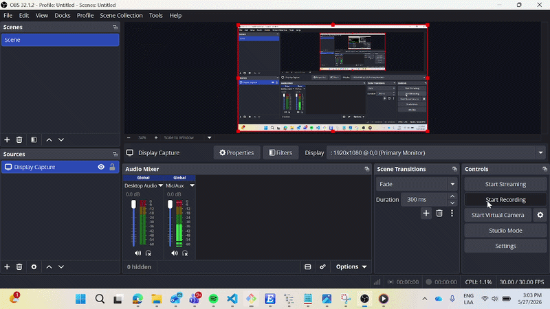

# Python QA Automation Framework

Automated testing framework built with Python, Selenium, pytest, and GitHub Actions using the Page Object Model (POM) design pattern.

[](https://github.com/GuillermoReyesMtz/python-qa-automation-framework/actions/workflows/automation.yml)

---

# Demo



---

# Features

- Selenium WebDriver automation
- pytest test framework
- Page Object Model (POM) architecture
- GitHub Actions CI integration
- Headless Chrome execution
- Automatic screenshots on test failure
- Explicit waits and synchronization handling
- End-to-end checkout flow automation
- Cross-environment execution (local + cloud runners)

---

# Technologies Used

- Python
- Selenium WebDriver
- pytest
- webdriver-manager
- GitHub Actions
- Chrome Headless

---

# Implemented Test Flows

## Login Flow
- Valid login test
- URL validation after authentication

## Logout Flow
- Successful logout validation
- Session redirect verification

## Add To Cart Flow
- Add all products to cart
- Dynamic cart badge validation
- Dynamic product counting without hardcoded values

## Checkout Flow
- Full checkout process automation
- Cart navigation
- User information form completion
- Order completion validation
- Final confirmation message assertion

---

# Project Structure

```bash
python-qa-automation-framework/
│
├── assets/
├── tests/
├── pages/
├── utils/
├── reports/
├── screenshots/
├── .github/workflows/
├── requirements.txt
├── pytest.ini
├── conftest.py
└── README.md
```
---

# Design Pattern

This framework follows the **Page Object Model (POM)** design pattern.

Each page of the application is represented by a dedicated Python class containing:
- Locators
- Page actions
- Reusable methods

This architecture improves:
- Maintainability
- Scalability
- Readability
- Test stability

Example structure:

```bash
pages/
├── login_page.py
├── inventory_page.py
├── cart_page.py
├── checkout_page.py
├── checkout_page_two.py
└── complete_page.py
```

---

# CI/CD Integration

GitHub Actions automatically executes the test suite on every push to the repository.

Implemented pipeline features:
- Dependency installation
- Headless Chrome execution
- Automated pytest execution
- CI validation on push

Workflow location:

```bash
.github/workflows/automation.yml
```

---

# Synchronization Handling

To improve automation reliability, the framework implements:
- Explicit waits
- URL synchronization
- Clickable element validation
- Dynamic state verification

Special handling was implemented for:
- Headless browser timing issues
- Chrome password manager popup interference
- Cloud runner synchronization inconsistencies

---

# Screenshots on Failure

When a test fails:
- A screenshot is automatically captured
- Screenshots are stored inside the `/screenshots` directory
- Helps debugging both local and CI failures

---

# Installation

## Clone the repository

```bash
git clone
```
## Enter the project folder

```bash
cd python-qa-automation-framework
```
## Create virtual environment
```bash
python -m venv venv
```
## Activate virtual environment
### Windows:
```bash
venv\Scripts\activate
```
### Linux/Mac:
```bash
source venv/bin/activate
```
## Install dependencies:
```bash
pip install -r requirements.txt
```
## Run tests:
```bash
pytest
```

# Future improvements

- Parallel execution with pytest-xdist
- Docker integration
- Allure reporting
- API automation testing
- Data-driven testing
- Cross-browser testing
- Jenkins pipeline integration

# Autor

Guillermo Reyes Martínez

- Mechatronics Engineer
- Master's in Computer Science
- QA Automation enthusiast
- AI and NLP background
- [LinkedIn](https://www.linkedin.com/in/guillermo-reyes-mart%C3%ADnez-a074161b7/)